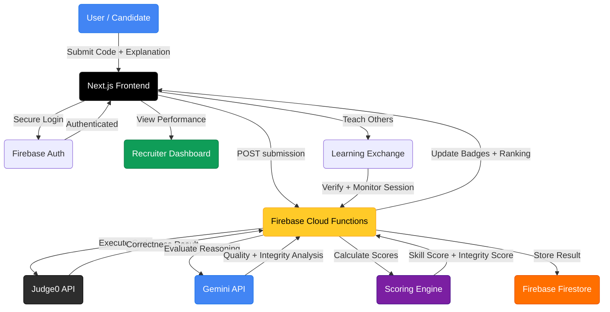
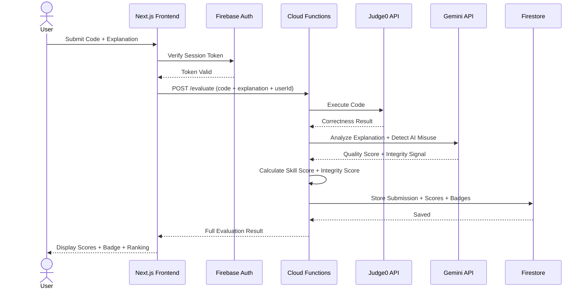

<div align="center">

# SkillRank AI

### Verify Real Skills. Hire with Confidence.

> Submit code and explanation -> Get dual-scored on Skill and Integrity -> Prove real ability in the AI era. No resume claims. No AI shortcuts. Just verified skills.

<br/>

[](https://nextjs.org/)
[](https://www.typescriptlang.org/)
[](https://tailwindcss.com/)
[](https://firebase.google.com/)
[](https://deepmind.google/technologies/gemini/)
[](https://judge0.com/)
[](https://www.amd.com/en/products/epyc.html)
[](https://vercel.com/)

<br/>


<br/>

---

_[The Idea](#the-idea) · [How It Works](#how-it-works) · [Features](#features) · [Architecture](#system-architecture) · [Structure](#project-structure) · [Quick Start](#quick-start) · [AMD Hardware](#amd-hardware-integration) · [Cost](#implementation-cost) · [Roadmap](#roadmap)_

---

</div>

<br/>

## The Idea

_SkillRank AI_ is a skill verification platform built for the AI era. Today, resumes do not prove actual ability, and AI-generated solutions make it nearly impossible for recruiters to trust candidates. Most existing platforms check only the final answer — not the reasoning behind it.

SkillRank AI solves this by giving users real-world challenges where they must submit _both code and explanation_. The system evaluates not just correctness but also understanding and thinking process.

> _USP:_ A dual scoring system that measures both coding ability and integrity — detecting AI misuse while rewarding real understanding. Recruiters get verified skill proof, not resume claims.

<br/>

---

## How It Works

SkillRank AI evaluates every submission across two dimensions:

| Score             | What It Measures                                             |
| :---------------- | :----------------------------------------------------------- |
| _Skill Score_     | Coding ability, correctness, and depth of understanding      |
| _Integrity Score_ | Honesty, AI misuse probability, and accountability over time |

### Scoring Pipeline

```
User Submission (Code + Explanation)
    |
    |-- Judge0 API
    |       └── Secure code compilation & execution -> correctness check
    |
    |-- Gemini API
    |       |-- Code quality evaluation
    |       |-- Explanation analysis (reasoning depth)
    |       └── AI misuse probability detection
    |
    |-- Firebase Cloud Functions
    |       |-- Skill Score calculation
    |       |-- Integrity Score update
    |       └── Badge & percentile assignment
    |
    └── Recruiter Dashboard
            |-- Verified skill badges
            |-- Percentile ranking
            └── Performance benchmarks
```

### Learning Exchange

Users can teach skills to others — but only after _passing a verification test_ first. Teaching sessions are monitored, and feedback automatically updates scores. This ensures real knowledge sharing with accountability.

```
[+]  Pass verification test -> unlock teaching ability
[+]  Conduct teaching session -> monitored in real time
[+]  Receive feedback -> scores updated automatically
[+]  Misuse or withdrawal -> penalty applied
[+]  Contribution unlocks advanced platform features
```

<br/>

---

## Features

### Core Capabilities

| Feature                         | Description                                                            |
| :------------------------------ | :--------------------------------------------------------------------- |
| _Real-World Challenges_         | Scenario-based problems that test practical, not theoretical, skills   |
| _Code + Explanation Submission_ | Users must submit both working code and reasoning behind it            |
| _AI-Powered Evaluation_         | Gemini API evaluates code quality, explanation depth, and AI misuse    |
| _Skill Score_                   | Performance-based score measuring coding ability and understanding     |
| _Integrity Score_               | Trust and behaviour tracking across all submissions over time          |
| _AI Misuse Detection_           | Flags likely AI-generated submissions using reasoning analysis         |
| _Learning Exchange_             | Peer-to-peer teaching with verification, monitoring, and feedback      |
| _Teacher Verification_          | Users must pass a test before they are allowed to teach others         |
| _Automatic Score Updates_       | Feedback from teaching sessions updates scores in real time            |
| _Penalty System_                | Withdrawal or misuse triggers score penalties and accountability flags |
| _Contribution Unlock System_    | Teaching and contributing unlocks advanced platform features           |
| _Recruiter Dashboard_           | Verified skill badges, percentile rankings, and performance benchmarks |

### Platform Capabilities

```
[+]  Real-world scenario-based coding challenges
[+]  Dual scoring — Skill Score + Integrity Score
[+]  Gemini API for code quality and reasoning evaluation
[+]  Judge0 API for secure code compilation and execution
[+]  AI misuse probability detection per submission
[+]  Peer-to-peer learning exchange with accountability
[+]  Verified skill badges for recruiter trust
[+]  Percentile ranking and performance benchmarks
[+]  Firebase Auth — secure login and user management
[+]  Firestore — stores users, challenges, scores, feedback, sessions
[+]  Vercel deployment — fast and globally distributed
```

<br/>

---

## System Architecture



<br/>

---

## Data Flow



<br/>

---

## Tech Stack

| Layer            | Technology               | Purpose                                                       |
| :--------------- | :----------------------- | :------------------------------------------------------------ |
| _Frontend_       | Next.js + TypeScript     | Fast, type-safe UI with server-side rendering                 |
| _Code Editor_    | Monaco Code Editor       | In-browser IDE for code submission                            |
| _Styling_        | Tailwind CSS             | Utility-first responsive design                               |
| _Auth_           | Firebase Authentication  | Secure login and user session management                      |
| _Backend Logic_  | Firebase Cloud Functions | Challenge engine, scoring, integrity logic, learning exchange |
| _Database_       | Firebase Firestore       | Users, challenges, scores, feedback, sessions                 |
| _Code Execution_ | Judge0 API               | Secure sandboxed code compilation and execution               |
| _AI Evaluation_  | Gemini API               | Code quality, explanation analysis, AI misuse detection       |
| _Hosting_        | Vercel                   | Global deployment with edge performance                       |
| _Hardware_       | AMD EPYC + Instinct      | High-performance backend and AI inference acceleration        |

<br/>

---

## Project Structure

```
AMD-WEBSITE/
|
|-- app/                              # Next.js App Router
|   |-- (auth)/                       # Auth-gated routes
|   |   |-- dashboard/                # User dashboard + scores
|   |   |-- challenge/[id]/           # Challenge submission page
|   |   |-- learn/                    # Learning Exchange
|   |   └── recruiter/                # Recruiter dashboard
|   |-- api/                          # API routes
|   |   |-- evaluate/                 # Trigger Cloud Functions evaluation
|   |   └── leaderboard/              # Ranking data endpoints
|   └── layout.tsx                    # Root layout + providers
|
|-- components/                       # Reusable UI components
|   |-- Editor/                       # Monaco Code Editor wrapper
|   |-- ScoreCard/                    # Skill + Integrity score display
|   |-- ChallengeCard/                # Challenge listing component
|   └── RecruiterBadge/               # Verified skill badge renderer
|
|-- lib/                              # Utilities and config
|   |-- firebase.ts                   # Firebase init + Firestore client
|   |-- judge0.ts                     # Judge0 API client
|   └── gemini.ts                     # Gemini API client
|
|-- functions/                        # Firebase Cloud Functions
|   |-- evaluate.ts                   # Main evaluation pipeline
|   |-- scoring.ts                    # Skill Score + Integrity Score logic
|   |-- integrity.ts                  # AI misuse detection
|   └── exchange.ts                   # Learning Exchange flow
|
|-- types/                            # TypeScript type definitions
|-- public/                           # Static assets
|-- tailwind.config.ts                # Tailwind configuration
|-- tsconfig.json                     # TypeScript configuration
└── .env.example                      # Environment variable template
```

<br/>

---

## Quick Start

### Prerequisites

- [Node.js 18+](https://nodejs.org/) + npm
- [Firebase](https://firebase.google.com/) project with Auth + Firestore + Functions enabled
- [Judge0 API](https://judge0.com/) key
- [Gemini API](https://ai.google.dev/) key
- [Vercel](https://vercel.com/) account (for deployment)

---

### 1. Clone the Repository

```bash
git clone https://github.com/neil-data/AMD-WEBSITE.git
cd AMD-WEBSITE
```

---

### 2. Install Dependencies

```bash
npm install
```

---

### 3. Configure Environment

```bash
cp .env.example .env.local
```

Edit `.env.local`:

```env
NEXT_PUBLIC_FIREBASE_API_KEY=your_api_key
NEXT_PUBLIC_FIREBASE_AUTH_DOMAIN=your_project.firebaseapp.com
NEXT_PUBLIC_FIREBASE_PROJECT_ID=your_project_id
NEXT_PUBLIC_FIREBASE_STORAGE_BUCKET=your_project.appspot.com
NEXT_PUBLIC_FIREBASE_MESSAGING_SENDER_ID=your_sender_id
NEXT_PUBLIC_FIREBASE_APP_ID=your_app_id

JUDGE0_API_KEY=your_judge0_api_key
GEMINI_API_KEY=your_gemini_api_key
```

---

### 4. Run the Development Server

```bash
npm run dev
# App runs at http://localhost:3000
```

---

### 5. Deploy to Vercel

```bash
npm install -g vercel
vercel
```

<br/>

---

## AMD Hardware Integration

SkillRank AI is designed to leverage _AMD hardware_ for high-performance backend processing and AI inference.

| AMD Product            | Role in SkillRank AI                                                                          |
| :--------------------- | :-------------------------------------------------------------------------------------------- |
| _AMD EPYC Processors_  | Handles backend API requests, challenge evaluation, and scoring for multiple concurrent users |
| _AMD Instinct GPUs_    | Accelerates AI model inference — speeds up code evaluation and reasoning analysis via Gemini  |
| _AMD Ryzen Processors_ | Provides smooth local development environment performance for contributors                    |
| _AMD-Powered Cloud_    | Deploy backend services on AMD-powered cloud infrastructure for cost-efficient scaling        |

_Why AMD?_

```
[+]  High performance for concurrent AI workloads
[+]  Energy efficient — lower cost at scale
[+]  Cost-effective for early-stage startups
[+]  Optimized for AI inference and cloud deployments
```

<br/>

---

## Security and Reliability

| Area                  | Implementation                                                                      |
| :-------------------- | :---------------------------------------------------------------------------------- |
| _Authentication_      | Firebase Auth manages all user sessions — no unauthenticated access                 |
| _Code Execution_      | Judge0 API runs all code in a secure sandboxed environment                          |
| _AI Misuse Detection_ | Gemini API flags AI-generated submissions per evaluation                            |
| _Integrity Tracking_  | Integrity Score persists across all submissions — misuse has long-term consequences |
| _Penalty System_      | Withdrawal or misuse triggers score penalties and accountability flags              |
| _Secrets_             | All API keys stored in `.env` — never committed to version control                  |
| _Firestore Rules_     | Role-based access rules protect user data and recruiter views                       |

<br/>

---

## Implementation Cost

Estimated MVP implementation cost:

| Resource                                         | Estimated Cost                |
| :----------------------------------------------- | :---------------------------- |
| Frontend + Backend Development (2-3 months)      | Rs. 3,00,000 - Rs. 5,00,000   |
| Firebase (Auth, Firestore, Functions) — 6 months | Included below                |
| Judge0 API — code execution                      | Included below                |
| Gemini API — AI evaluation                       | Included below                |
| Vercel Hosting                                   | Included below                |
| Cloud & API Total (6 months)                     | Rs. 80,000 - Rs. 2,00,000     |
| Domain & basic tools                             | Rs. 10,000 - Rs. 20,000       |
| _Total MVP Estimate_                             | _Rs. 4,00,000 - Rs. 7,00,000_ |

> Development cost is primarily computing resources and open-source tooling. The platform is designed to scale efficiently on AMD-powered cloud infrastructure.

<br/>

---

## Example Output

```
--------------------------------------------------
         SKILLRANK AI - EVALUATION REPORT
--------------------------------------------------

SUBMISSION DETAILS
--------------------------------------------------
  Challenge         :  Binary Search Tree Validator
  Language          :  Python 3
  Submitted At      :  2024-08-01  10:30:00

CODE EVALUATION (Judge0)
--------------------------------------------------
  Correctness       :  Passed (8 / 10 test cases)
  Runtime           :  42 ms
  Memory Usage      :  14.2 MB

REASONING EVALUATION (Gemini)
--------------------------------------------------
  Explanation Depth :  Strong
  Code Quality      :  High
  AI Misuse Signal  :  Low (0.12)

SCORES
--------------------------------------------------
  Skill Score       :  84 / 100
  Integrity Score   :  91 / 100
  Percentile        :  Top 14%

BADGE AWARDED
--------------------------------------------------
  Verified — Python Problem Solving (Level 2)
--------------------------------------------------
```

<br/>

---

## Roadmap

|  Status  | Feature                                             |
| :------: | :-------------------------------------------------- |
|   Done   | Dual scoring system — Skill Score + Integrity Score |
|   Done   | Judge0 API code execution integration               |
|   Done   | Gemini API reasoning and AI misuse evaluation       |
|   Done   | Firebase Auth + Firestore data layer                |
|   Done   | Recruiter dashboard with verified badges            |
|   Done   | Learning Exchange with teacher verification         |
| Upcoming | Mobile app (iOS + Android)                          |
| Upcoming | Multi-language challenge support                    |
| Upcoming | Company-specific private challenge rooms            |
| Upcoming | Resume builder from verified skill badges           |
| Upcoming | Interview simulation mode                           |
| Upcoming | Analytics dashboard for institutions                |
| Upcoming | AMD ROCm-accelerated local inference option         |

<br/>

---

## Contributing

Contributions are always welcome!

```bash
# 1. Fork the repository
# 2. Create your feature branch
git checkout -b feature/amazing-feature

# 3. Commit your changes
git commit -m "feat: add amazing feature"

# 4. Push to your branch
git push origin feature/amazing-feature

# 5. Open a Pull Request
```

Please follow [Conventional Commits](https://www.conventionalcommits.org/) for commit messages.

<br/>

---

## License

This project is licensed under the [MIT License](LICENSE).

<br/>

---

<div align="center">

Built with love by **Team Hexa Mind** — AI In Education & Skilling Track

<br/>

_Neil Banerjee_

<br/>

</div>
